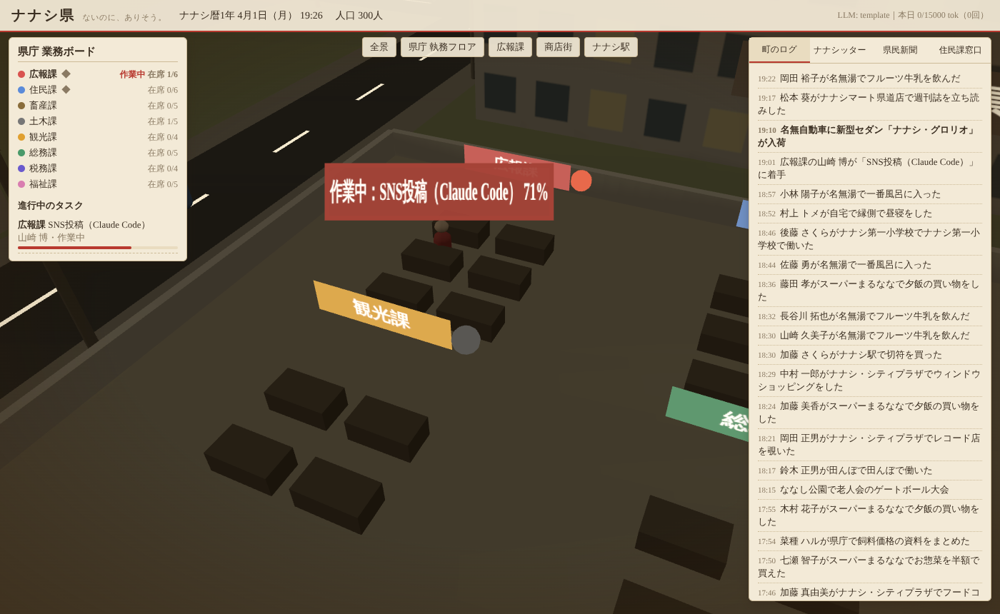
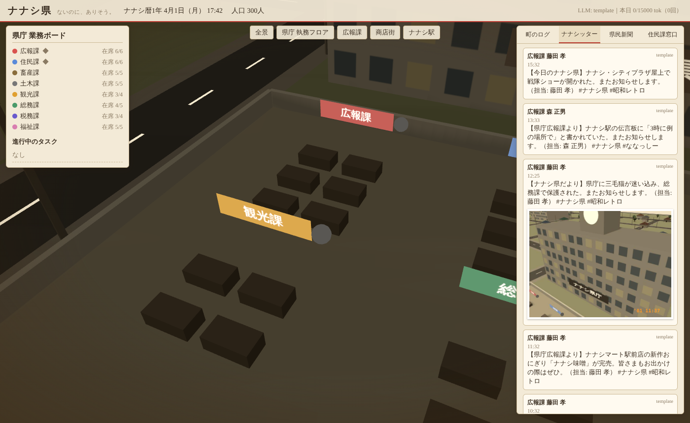

# ナナシ県 — ないのに、ありそう。

存在しない「ナナシ県」を 3DCG で運営するシミュレーション。
昭和の空気が少し残る町で、数百人の CP（住民）が暮らしている。県庁では 8 つの部署が働く。
広報課は町の出来事を SNS（ナナシッター）と県民新聞で発信し、住民課は新しい住民や人間のアバターを受け入れる。

| 広報課が作業中（3D と連動） | ナナシッターと写真 |
|---|---|
|  |  |

## 動かし方

```bash
npm install        # three.js（描画ライブラリ）だけ
npm start          # http://localhost:8787
```

- 起動直後は 1 日目の 6:30。ゲーム内 1 分 = 現実 1 秒（1 日 ≒ 24 分）。
- 早回し: `NANASHI_SPEED=6 npm start`
- 状態は `data/` に保存され、再起動しても住民は残る（`data/` はコミットしない）。

## 画面

| 場所 | 内容 |
|---|---|
| 上部 | 日付・時刻・人口・LLM モードと本日のトークン使用量 |
| 左「県庁 業務ボード」 | 部署ごとの在席数。進行中のタスク（担当 CP・移動中／作業中・進み具合） |
| 右タブ | 町のログ ／ ナナシッター（写真つき投稿）／ 県民新聞 ／ 住民課窓口（CP 追加・アバター登録） |
| カメラ | 全景・県庁 執務フロア・広報課・商店街・ナナシ駅・自分のアバター |
| CP をクリック | 名前・年齢・所属・いまの行動を表示 |

**連動**: 広報課がタスクを受けると、担当の CP が席（写真なら現場）まで歩く。着くと「作業中：SNS投稿 45%」の札が頭上に出て、部署の作業中ランプが赤く点く。
写真撮影では、開いているブラウザがその場所を 3D から撮影する（断面キャプチャ）。撮った写真は、フィルム風の日付を入れて投稿に添付される。

## トークン節約（最優先の方針）

| モード | 内容 | トークン |
|---|---|---|
| `template`（既定） | 出来事・SNS・新聞をすべてテンプレートで作る | **0** |
| `omniroute` | [OmniRoute](https://github.com/diegosouzapw/OmniRoute)（OpenAI 互換ゲートウェイ）に短く 1 回だけ聞く | 上限つき |
| `claude` | Claude Code を `claude -p` で起動する。`ANTHROPIC_BASE_URL` を OmniRoute に向ける | 上限つき |

使い過ぎを防ぐ仕組み:
- CP の行動はすべてランダム選択で、LLM を使わない。LLM を使うのは広報課の文章だけ。
- LLM に渡すのは、ローカルで要約したダイジェスト（最大 8 件）だけ。`max_tokens` は 220。
- 回数に上限がある（`maxCallsPerGameDay`: SNS 4 回・新聞 1 回／ゲーム内 1 日）。1 日のトークン予算も決めてある（`dailyTokenBudget`: 15000）。どちらかに達するとテンプレートに切り替わる。
- 同じ入力の結果はキャッシュして、もう一度は課金しない。失敗したときもテンプレートに戻るので、止まらない。
- Claude Code はツールなしで起動する。cwd は `data/` にして、リポジトリの CLAUDE.md やスキルを読み込ませない。

### OmniRoute を使う場合

```bash
npx omniroute                    # ダッシュボード http://localhost:20128 でプロバイダ（無料枠など）を接続し、API キーを発行
cp .env.example .env             # OMNIROUTE_API_KEY を記入（.env はコミットしない）
NANASHI_LLM_MODE=omniroute npm start
```

モデルは `nanashi.config.json` の `llm.omniroute.model` で指定する（例: OmniRoute のコンボ名）。
Claude Code 自体を OmniRoute 経由で使うには `scripts/claude-omniroute.sh` を使う。

## Claude Code スキル（CP にスキルを持たせる）

| スキル | 役割 |
|---|---|
| `/nanashi-koho` | 広報課として SNS 投稿・県民新聞を書く。実行中は 3D の広報課 CP が「作業中（Claude Code）」になる |
| `/nanashi-jumin` | 住民課として CP を追加する・人間アバターを登録する（LLM 不使用） |

## API（抜粋）

| メソッド | パス | 用途 |
|---|---|---|
| GET | `/api/digest` | 今日の重要な出来事の要約（LLM に渡す素材） |
| POST | `/api/residents` | 転入届（CP 追加）`{name?, role, work?}` |
| POST | `/api/avatars` | アバター登録 `{name, color}` → `token` |
| POST | `/api/tasks` | 外部実行タスク `{type: sns_post\|newspaper, external: true}` |
| POST | `/api/tasks/:id/complete` | 外部実行の結果 `{text}` |
| GET | `/events` | SSE（frame / clock / log / sns / news / photo_request …） |

## 記録

- `data/logs/day-NNNN.jsonl`: すべての行動ログ
- `data/snapshots/day-NNNN-HH.json`: 毎時の断面（施設ごとの人数、タスク）
- `data/sns/posts.jsonl`、`data/news/*.md`、`data/photos/*.jpg`: 発信物

## 構成

```
server/  index.js（HTTP+SSE）sim.js（CP・県庁・タスク）executor.js（LLM・予算）chronicle.js（記録）world.js（地図）lore.js（世界観）
client/  index.html main.js（描画・UI・撮影）town.js（町並み）style.css
docs/nanashi/  team.md（SM・PM の判断記録）world-bible.md（世界設定）
```

テスト: `npm test`
