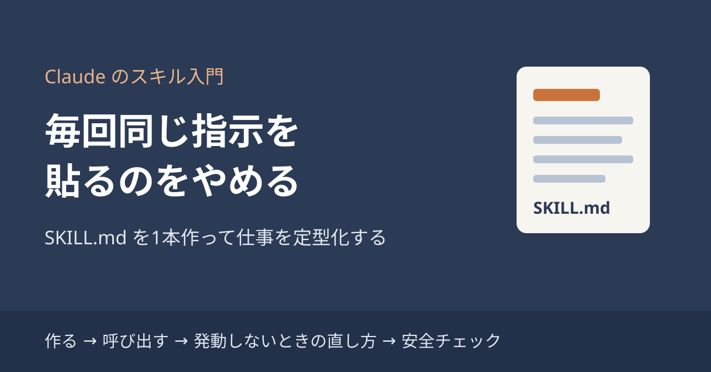
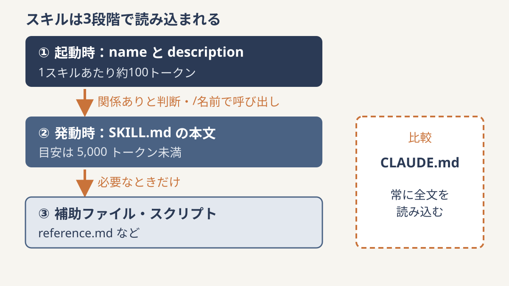
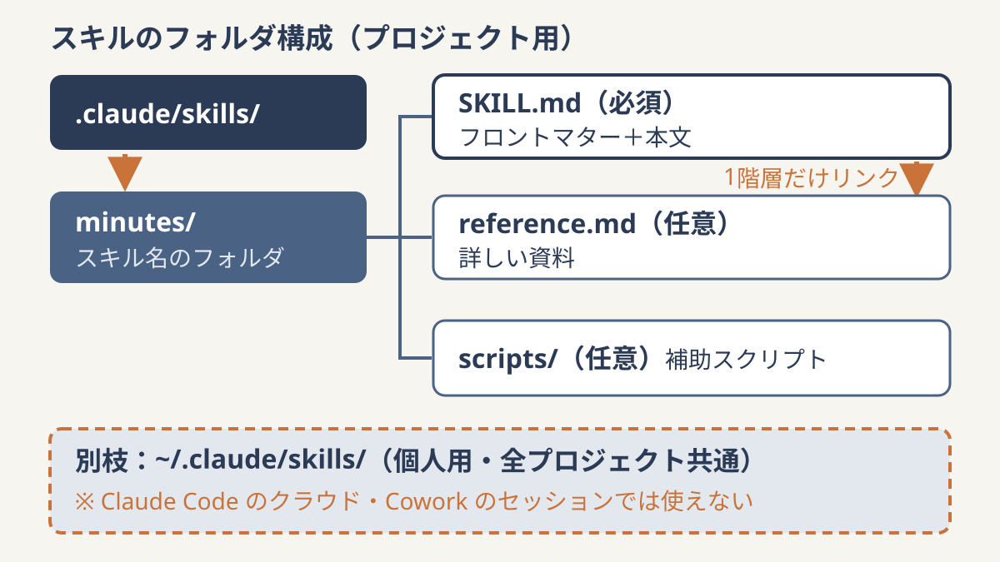

# 毎回同じ指示を貼るのをやめる：Claude の「スキル（SKILL.md）」を1本作って仕事を定型化する入門



「記事の下書きはこのルールで」「レビューではこの観点を見て」「議事録はこの形式で」。Claude を使い始めると、こうした指示を毎回チャットに貼り直していませんか。貼り忘れた日だけ出来上がりの品質がぶれて、結局自分で直す……という経験がある方も多いと思います。

この「毎回の指示」を1枚のファイルにまとめて使い回せるのが、Claude の **スキル（Skills）** です。この記事では、スキルとは何かを CLAUDE.md やふだんのプロンプトとの違いから整理し、最初の1本を作って呼び出すところまでを手順で説明します。「作ったのに発動しない」ときの直し方と、他人のスキルを入れる前の安全チェックもあわせて紹介します。

読み終えるころには、自分の定型作業を SKILL.md 1枚にまとめて `/名前` で呼び出せるようになるはずです。

## スキルとは何か：CLAUDE.md・プロンプトとの違い

スキルは、「指示・参考資料・補助ファイル」を1つのフォルダにまとめたものです。中心になるのは、先頭に YAML のフロントマター（設定欄）が付いた `SKILL.md` というファイルです。Claude が「今の作業に関係がある」と判断したときに自動で読み込むほか、`/スキル名` と入力して手動で呼び出すこともできます [1]。

似た仕組みとの違いを整理しておきます。

- **CLAUDE.md との違い**: CLAUDE.md は常に読み込まれます。スキルの本文は使うときだけ読み込まれるので、大きな参考資料を持たせてもトークンを圧迫しにくいのが特長です [1]。
- **プロンプトとの違い**: プロンプトは1回きりの会話向けです。スキルは一度作れば自動で使われるので、同じ説明を繰り返さなくて済みます [2]。

ざっくり言えば、「いつも守ってほしい全体のルール」は CLAUDE.md、「特定の作業のときだけ必要な手順や資料」はスキル、と分けると考えやすくなります。

スキルが軽く動くのは、**段階的な読み込み（progressive disclosure）** という仕組みのおかげです [2]。

1. 起動時に読み込まれるのは `name` と `description` だけ（1スキルあたり約100トークン）
2. 発動したときに SKILL.md の本文を読み込む（目安は 5,000 トークン未満）
3. 補助ファイルやスクリプトは、本文の指示で必要になったときだけ読む



たくさんスキルを入れても、ふだん消費するのは一覧の短い説明だけ、というイメージです。

## 最初のスキルを作る：フォルダ構成と SKILL.md の書き方

ここでは Claude Code を例にします。スキルの置き場所は2種類あります [1]。

- **個人用**: `~/.claude/skills/<名前>/SKILL.md`（自分のすべてのプロジェクトで使える）
- **プロジェクト用**: `.claude/skills/<名前>/SKILL.md`（そのリポジトリだけで使える）

ひとつ注意があります。個人用の `~/.claude/skills/` は、Claude Code のクラウド上のセッションや Cowork のセッションでは使えません [1]。クラウドで作業することが多いなら、リポジトリ内の `.claude/skills/` に置くと詰まりにくくなります。なお、プラグインを通じて配布する方法もあります [1]。



SKILL.md の中身は、たとえば議事録用ならこんな形になります。

```markdown
---
name: minutes
description: 会議のメモや文字起こしから、決定事項・宿題・次回日程を整理した議事録を作る。「議事録にして」「会議メモをまとめて」と頼まれたときに使う。
---

# 議事録の作り方
1. 冒頭に日付・参加者・議題を書く
2. 「決定事項」「宿題（担当・期限）」「次回」の3見出しでまとめる
3. 発言の要約は1行ずつ、推測で補わない
```

書くときのルールとコツは次のとおりです。

- `name` は64文字以内で、小文字の英数字とハイフンだけ。「anthropic」「claude」という語は使えません [2][3]。
- `description` は1,024文字以内です [2][3]。Claude Code では、description と `when_to_use` の合計が一覧上 1,536 文字で切られます [1]。
- 本文は500行未満が目安です。長くなったら reference.md などに分け、SKILL.md から1階層だけリンクします。深い入れ子は読み飛ばされやすくなります [1][3]。
- Claude はもともと多くのことを知っているので、一般的な説明は省き、**その仕事特有のルールだけ**を書きます。簡潔さがいちばん大事です [3]。

「何を書けばいいか分からない」ときは、まずスキル無しで一度作業してみてください。そのとき自分が何度も補足した情報が、スキルに書くべき内容です。それを洗い出したら、Claude に「このやり方をスキルにして」と頼めば正しい形式で作ってくれます [3]。

なお、以前からある `.claude/commands/xxx.md`（カスタムコマンド）はスキルに統合されました。今も動きますが、補助ファイルや自動発動の制御などはスキル形式でしか使えません [1]。

## 呼び出してみる：`/名前` と自動発動、発動しないときの直し方

作ったスキルは、`/minutes` のように名前で呼び出せます。`/スキル名` の後ろに書いた文字は、本文の `$ARGUMENTS` や `$0` `$1` の位置に差し込めます [1]。たとえば対象ファイル名を引数として渡す、といった使い方ができます。

用途に応じて、フロントマターで動き方を調整できます [1]。

- `disable-model-invocation: true`: 自動発動を止め、手動で呼んだときだけ動かす。デプロイのように副作用がある作業に向いています。
- `user-invocable: false`: `/` メニューから隠す。
- `allowed-tools`: スキル実行中に使うツールを事前に許可する（例: `Bash(git *)`）。

### 発動しないときは description を直す

「作ったのに自動で使われない」というときは、まず description を見直します。description には **「何をするか」と「いつ使うか」の両方** を書き、三人称で書くのがコツです。「〜を手伝えます」ではなく「〜を処理する」のように書きます。「書類を手伝う」のような曖昧な説明は発動しにくくなります [3]。

確かめ方はシンプルです。発動してほしい言い方を何通りか試し、発動しなければ description を直します [4]。公式のベストプラクティスでは、3つ程度の評価シナリオを先に作っておくことが推奨されています [3]。上の議事録の例なら、「議事録にして」「この会議メモを整理して」「今日の打ち合わせの要点をまとめて」の3つで試す、といった具合です。

### 実例：このチームもスキルで動いています

じつはこの記事を作っている「AI社員チーム」も、スキルで動いています。リポジトリの `.claude/skills/` に、リサーチ・記事生成・素材挿入・品質チェック・集客の担当5本、監査役1本、全体をまとめる統括1本の **計7本** のスキルを置き、「リサーチ→記事→図→校正→告知」を分担しています。1本ずつは短い手順書ですが、組み合わせることで毎回同じ流れを再現できます。

## claude.ai で使う／他人のスキルを入れる前の安全チェック

スキルは Claude Code だけでなく、claude.ai でも使えます。スキルのフォルダを ZIP にまとめ、**Customize > Skills** からアップロードして有効化します。このとき、コード実行（code execution）を有効にしておく必要があります [4]。画面の名前は変わることがあり、資料によっては Settings > Features と書かれているものもあります [2]。見つからないときは最新の公式ヘルプを確認してください。

対象プランについても、資料によって書き方が異なります [2][4]。ご自身のプランで使えるかどうかは、公式ヘルプで確認するのが確実です。

もうひとつ覚えておきたいのが、**面ごとに同期されない** ことです。claude.ai に上げたスキルは API や Claude Code では使えないので、それぞれに用意する必要があります [2]。

### 他人のスキルを入れる前に

ネット上では便利なスキルが公開されていますが、スキルは指示とコードで Claude の動きを変えられます。そのため、自作か信頼できる提供元のものだけを使うのが基本です。入れる前に SKILL.md とスクリプトを全部読み、想定外の通信やファイル操作がないかを確認しましょう [2]。

チェックの目安は次の3つです。

- SKILL.md の本文に、作業と関係のない指示が混ざっていないか
- スクリプトが外部へデータを送ったり、関係のないファイルを消したりしていないか
- `allowed-tools` で必要以上に広い権限を許可していないか

## まとめ：次の一歩は「いちばんよく貼る指示」から

スキルは、毎回貼っていた指示を SKILL.md 1枚にまとめ、必要なときだけ Claude に読ませる仕組みです。ポイントをもう一度整理します。

- CLAUDE.md は常に読まれる全体ルール、スキルは特定の作業のときだけ読まれる手順書
- 置き場所は `.claude/skills/<名前>/SKILL.md`（個人用は `~/.claude/skills/`、ただしクラウド・Cowork では使えない）
- description には「何をするか」と「いつ使うか」を三人称で書き、発動しなければ直す
- 他人のスキルは中身を全部読んでから入れる

最初の1本は、あなたが「いちばんよくチャットに貼っている指示」から作るのがおすすめです。たとえば次のようなものが候補になります。

- 議事録の形式（決定事項・宿題・次回）
- コードレビューで見てほしい観点
- note やブログ記事の型（導入・見出し・まとめの流れ）

まずは1本作って、何通りかの言い方で呼び出してみてください。うまく発動しなければ description を1行直す。その繰り返しで、あなた専用の「毎回同じ指示」が要らない環境ができていきます。

## 参考
- [1] Extend Claude with skills - Claude Code Docs https://code.claude.com/docs/en/skills （確認日 2026-10-01）
- [2] Agent Skills（overview）- Claude Platform Docs https://platform.claude.com/docs/en/agents-and-tools/agent-skills/overview （確認日 2026-10-01）
- [3] Skill authoring best practices - Claude Platform Docs https://platform.claude.com/docs/en/agents-and-tools/agent-skills/best-practices （確認日 2026-10-01）
- [4] Creating custom Skills - Claude Help Center https://support.claude.com/en/articles/12512198-creating-custom-skills （確認日 2026-10-01、ページ記載の最終更新 2026-07-22）
