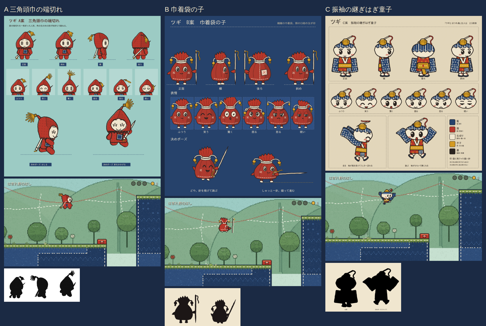

# ツギのデザイン候補（3案）— オーナーの選択待ち

| | A 三角頭巾の端切れ | B 巾着袋の子 | C 振袖の継ぎはぎ童子 |
|---|---|---|---|
| ひとこと | 茜の一枚布を折った頭巾。角の先の糸の房が気持ちで跳ねる | 縮緬の巾着袋の体。口紐の芥子の玉2つが印。自分より長い針の杖 | 藍の絣の大きな袖が腕。髷に縫い針の簪。走ると袖がはためき、跳ぶと翼のように広がる |
| 頭身 | 2 | 2.3（底が平らな雫型） | 2.5 |
| 配色 | 茜・生成り・藍・墨・芥子 | 茜・海老茶・生成り・芥子・墨 | 藍・茜・生成り・芥子・墨 |
| ぬいぐるみ | 作りやすい（三角＋台形） | いちばん作りやすい（袋の形そのまま） | 袖・帯で部品が多めだが映える |
| 独立レビュー「AIが作った感」 | 4/10 | 6/10 | 6/10 |
| レビューの推薦 | 3位: 赤ずきん・小人帽の連想 | 2位: 形は最強。ゲーム内で顔が読みにくい | **1位**: キャラ感・表情・袖の動き |
| 選ばれたら直すこと | 頭巾を「折り目・裁ち端」の形に作り直す | ドット絵の目を大きく、杖を太く、口紐は固定（子ども向け） | 袖の裏を茜/生成りにして地面の藍と分ける、胴の茜を大きく |

- 各案の設定画（4方向・表情6種・決めポーズ2つ）: `A/sheet.png` `B/sheet.png` `C/sheet.png`
- 黒塗りのシルエット: `*/silhouette.png`、実際のステージに置いた見本（画面の高さの約1/6）: `*/ingame.png`
- 配色表 `*/palette.md`、ぬいぐるみ化メモ `*/plush.md`、ねらい `*/notes.md`、レビュー全文 `review.md`、類似調査 `../similarity.md`
- どの案も 7/10 に届いていないため、選ばれた案はレビューの直しを入れて 7/10 以上にしてから、ヌイばあ・ボス・ほどき衆を同じ画風で揃える
- 類似の要確認: B は福袋・お守り、C は郷土玩具・和風ゆるキャラの連想。商標・意匠は J-PlatPat で人が確認（要確認）
