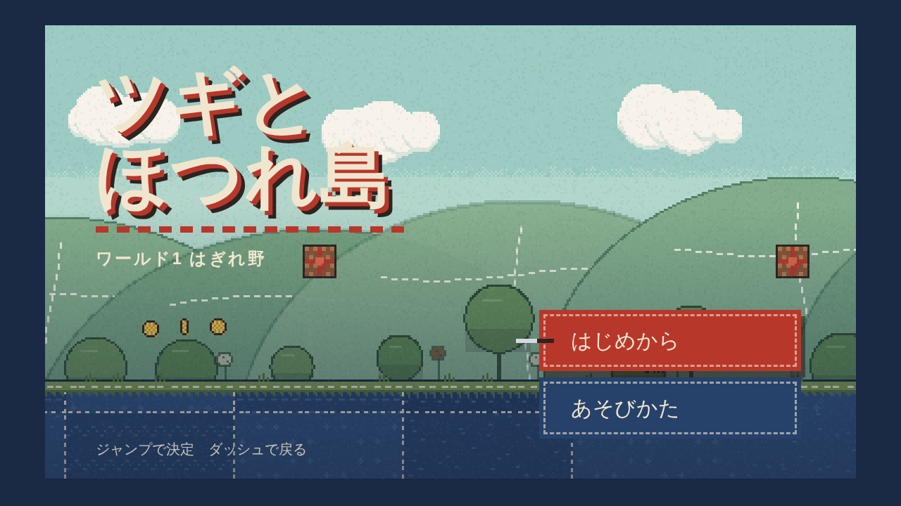
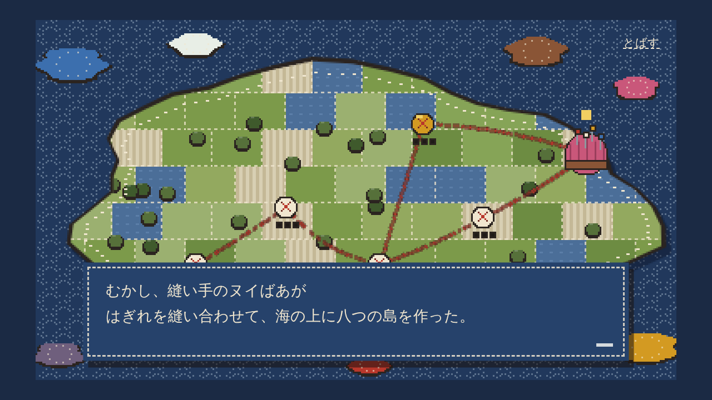
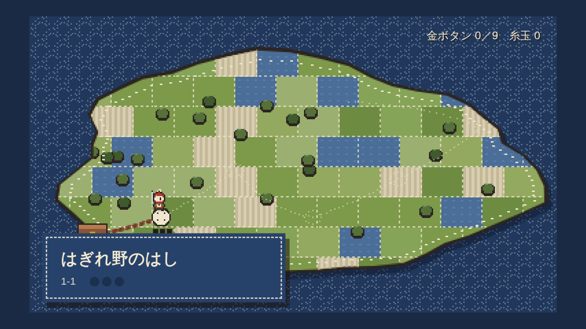
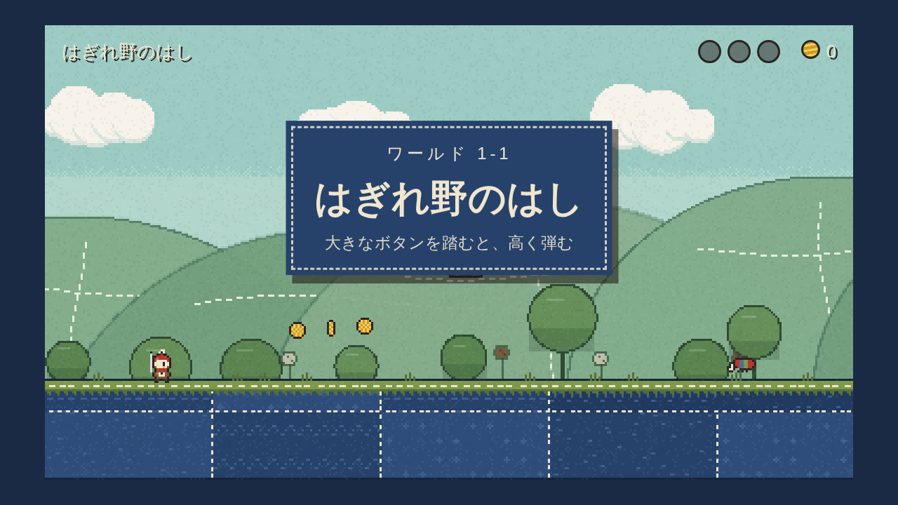
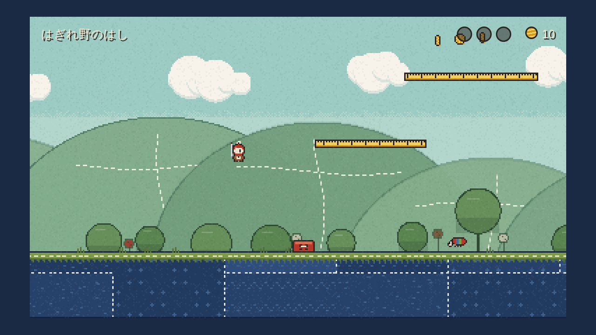
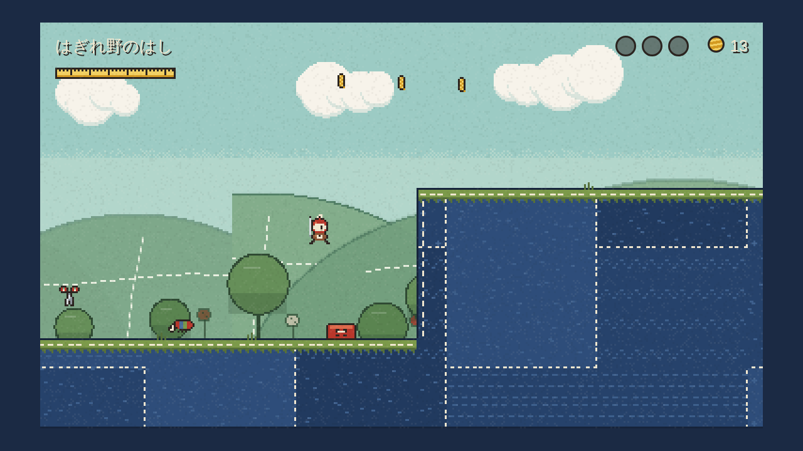
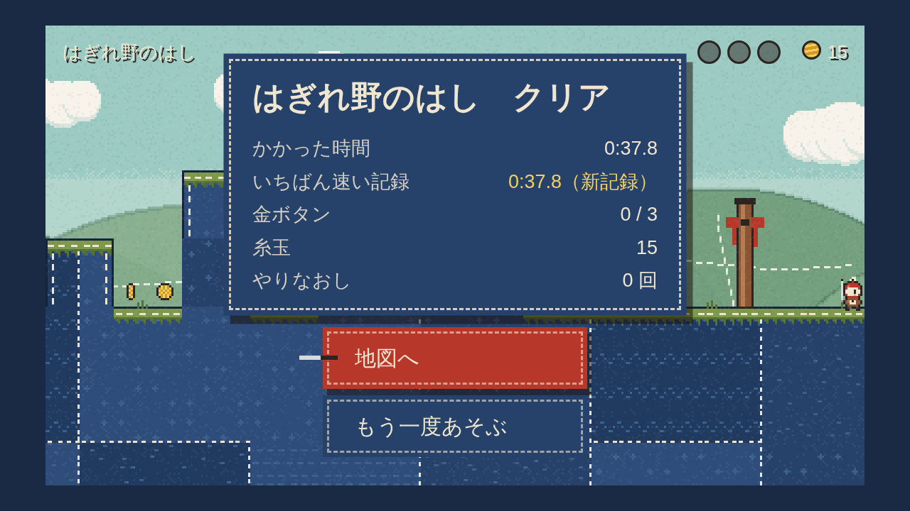
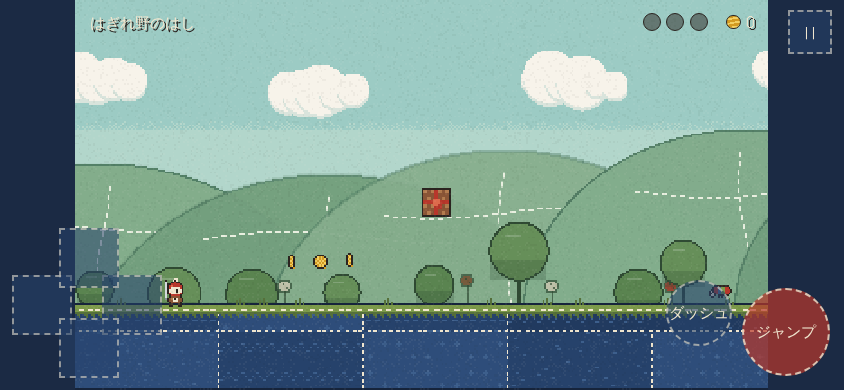

# 進捗: 垂直スライス ステージ1-1「はぎれ野のはし」（2026-10-02）

**結論: 1-1 は完成品質の手触りで遊べる。自動ゲート（slice）PASS、プレイテスト PASS、レビュー 条件付き合格（指摘のブロッカー2件は修正済み）。そのまま 1-2 以降の制作に進んでいる。**

## スクショ
| | |
|---|---|
| タイトル  | 物語の導入  |
| ワールドマップ  | ステージ名  |
| 1-1 前半（物差しの道）  | 1-1 後半（ばねの連続）  |
| 結果  | スマホ横持ち  |

## 遊び方（ローカル）
```
cd game && npm run serve      # → 表示された URL の index.html を開く
```
- PC: ← → 移動 / Z・スペース ジャンプ（長押しで高く）/ X・Shift ダッシュ / ↓ 物差しから降りる / Esc ひとやすみ
- パッド: 十字・スティック / A ジャンプ / B ダッシュ / Start
- スマホ: 横持ち。左下が十字、右下がジャンプとダッシュ

## 1-1 の中身（ばねボタンを育てる）
1. はじまり: 歩く・跳ぶ・踏む、つづらから綿毛
2. 見せる: ばねボタンで、普通のジャンプでは届かない崖へ
3. 試させる: ばねで穴と崖を越える／長押しで最高点の金ボタン
4. 試させる: ばねで物差しの上の道へ、針坊主の通路の上を渡る
5. ひねる: 待ち針（中間）、針の穴の島のばね（長押しすると蛾に当たる）
6. ひねる: 綿毛があれば上を滑空、無ければ谷を通る（別解）
7. 決めさせる: ばねの連続で針の大穴を越える
8. ゴールへ: 見えない壁の奥の金ボタン、結び目の杭
金ボタン3枚: ばねの最高点の裏道／ばね長押しの真上／見えない壁の奥

## 判定の要約
| | 結果 |
|---|---|
| 自動ゲート slice（`node .claude/game-studio/scripts/gate_check.mjs --gate slice`） | **PASS**: テスト7件、規約OK、クリア確認ボット（ゴール＋金ボタン3枚）、初心者ボット クリア率100%・死亡中央値5回・129秒、ブラウザ起動189ms・FPS最低60・エラー0 |
| プレイテスト（gs-playtester） | **PASS**: 入力遅延1f、最高速到達0.18秒（ダッシュ0.25秒）、ジャンプ高の可変幅3.0倍、コヨーテ7f、先行入力8f、カメラ先読み56px |
| レビュー（gs-reviewer） | **条件付き合格**、「AIが作った感」7/10。ブロッカー2件 → 修正済み（ヒットストップ中のジャンプ押下を先行入力に残す／1-1 を延長: 上手38秒・初心者129秒）。推奨のうち、ツギの配色（赤い頭＋青い胴 → 柿渋の胴に当て布と背中の針）、地面の刺し子の柄を当て布ごとに4種、結果画面の「もう一度」、保存データの版違いで進行を消さない、を反映済み |

詳細: `studio/playtests/2026-10-02-1-1.md`, `studio/reviews/2026-10-02-slice-1-1.md`

## 次
1-2 ほつれ橋・1-3 ファスナー谷（データ作成済み、調整中）→ 1-4 アイロン台地 → ひみつの縫い目 → 針山の砦とボス → エンディング
